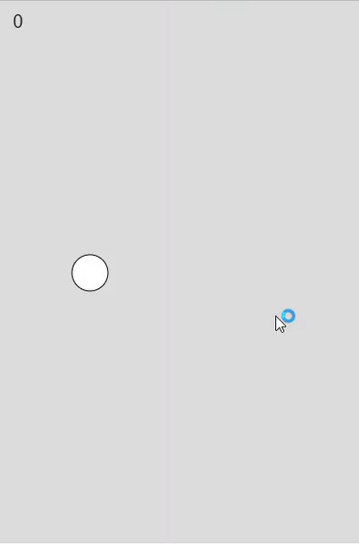

# Flappy Bird
This is a games that uses similar mechanics of the popular game Flappy Bird. written in JavasCript.
## Functionality
It works as it should, you can play the original game. When you click the circle (representing a bird) goes up, when you pass through a pipe the score goes up and when you collide with something you lose.
## How to run
  * Download the file 
  * Extract it anywhere
  * Open the index.html
  * You should see the game running!
## Video Example

